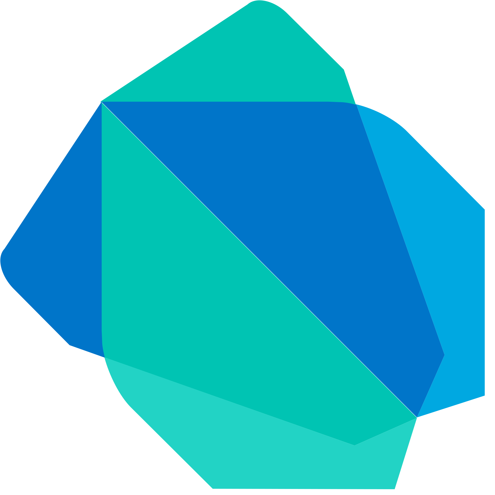

# 🚀 Welcome to My Github! 🚀

Hello! I'm Mike Kwak, born in Seoul, South Korea and raised in Vancouver. I love web development and skateboarding.

```javascript
const school = 'University of Waterloo';
const program = 'Software Engineering'

const interests = ['frontend', 'backend', 'machine learning'];
```

##### Programming Languages

<p align="center">



<br/>
</p>

#####  Databases/Cloud Services


<br/>

#####  Tools/Frameworks


<br/> 

## 🤓 Connect with me!
